<!-- ═══════════════════════════════════════════════════════════════════════ -->
<!--              DHARMANATH KADAM · CINEMATIC ULTIMATE EDITION              -->
<!--              Java Full Stack Developer · AI · Data Science              -->
<!-- ═══════════════════════════════════════════════════════════════════════ -->

 

  

---

## 📑 Table of Contents

<table>
<tr>
<td width="55%" valign="top">

| # | Section |
|:---:|:---|
| 1 | [👨‍💻 About Me](#about-me) |
| 2 | [🎯 Core Strengths](#core-strengths) |
| 3 | [💼 Experience](#experience) |
| 4 | [🚀 Featured Projects](#featured-projects) |
| 5 | [🏆 Achievements](#achievements) |
| 6 | [🛠️ Tech Stack](#tech-stack) |
| 7 | [📊 GitHub Activity](#github-activity) |
| 8 | [🌱 Currently Learning](#currently-learning) |
| 9 | [🤝 Connect With Me](#connect-with-me) |

</td>
<td width="45%" valign="top" align="center">

</td>
</tr>
</table>

---

## 👨‍💻 About Me

I'm a **B.Tech Computer Science & Engineering (Data Science)** student driven by a passion for building software that matters. I work at the intersection of **Java Full Stack Development**, **Artificial Intelligence**, and **Data Science** — designing backend systems, crafting responsive frontends, and turning ideas into working products.

<table>
<tr>
<td width="50%" valign="top">

**🎓 Education**
B.Tech CSE — Data Science

</td>
<td width="50%" valign="top">

**💻 Role**
Java Full Stack Developer — Spring Boot · React

</td>
</tr>
<tr>
<td width="50%" valign="top">

**🤖 Focus**
AI · Machine Learning · Generative AI

</td>
<td width="50%" valign="top">

**📊 Data**
Python · Pandas · Power BI

</td>
</tr>
<tr>
<td width="50%" valign="top">

**🚀 Mission**
Build clean, scalable, real-world software

</td>
<td width="50%" valign="top">

**🤝 Open To**
Full Stack / Backend / AI-ML roles

</td>
</tr>
</table>

---

## 🎯 Core Strengths

| Strength | What I Bring |
|:---|:---|
| 🧠 **Data Structures & Algorithms** | 150+ problems solved; strong in arrays, trees, DP, graphs |
| 🏗️ **Object-Oriented Design** | SOLID principles, clean architecture, design patterns in Java |
| 🔗 **REST API Design** | Secure, versioned, well-documented APIs with Spring Boot |
| 🗄️ **Database Modelling** | Normalized schemas, JPA/Hibernate, query optimization |
| 🎨 **Responsive UI** | Component-driven React, Tailwind, mobile-first layouts |
| 🤖 **ML Fundamentals** | Regression, classification, model evaluation, feature engineering |
| 🐛 **Debugging & Testing** | Postman, JUnit, structured logging |

---

## 💼 Experience

### 🔹 Java Full Stack Development Intern — **DASP Private Limited**
> **Duration:** 15 July – 15 September · **Location:** Pune, India · **Mode:** Hybrid (On-site & Online)

- Built RESTful APIs with **Spring Boot + Spring Data JPA + Hibernate**
- Designed and integrated **MySQL** schemas with normalized relationships
- Developed responsive **React** dashboards consuming backend APIs
- **Stack:** `Java` · `Spring Boot` · `JPA` · `Hibernate` · `REST` · `MySQL` · `React`

### 🔹 Java Full Stack Trainee — **The Kiran Academy**
> **Duration:** Sep 2025 – Mar 2026 (6 Months) · **Location:** Pune, India · **Mode:** Online

- Completed intensive training: **Core Java → Advanced Java → Spring Boot MVC → React**
- Implemented **Servlet/JSP** apps, JDBC persistence, and layered MVC architectures
- **Stack:** `Core Java` · `JDBC` · `SQL` · `Hibernate` · `Spring Boot MVC` · `React` · `Servlet/JSP` · `Postman`

### 🔹 Full Stack Development Intern — **AcmeGrade**
> **Duration:** Feb 2025 – Jun 2025 · **Location:** Karnataka, India · **Mode:** Online

- Worked across frontend, backend, and database layers on live tasks
- Collaborated with mentors on code reviews and feature iterations
- **Stack:** `HTML` · `CSS` · `JavaScript` · `Node.js` · `MongoDB`

---

## 🚀 Featured Projects

<table>
<tr>
<td width="50%" valign="top">

### 🏥 CareVision

**AI-Based Healthcare Platform** · `2024`

Healthcare platform combining ML prediction models, interactive dashboards, and AI-powered features.

`Python` · `Flask` · `MySQL` · `scikit-learn` · `Gemini API` · `Chart.js`

</td>
<td width="50%" valign="top">

### 🐾 PawStay AI

**AI-Powered Pet Care Platform** · `2024`

Smart pet home-stay platform connecting owners with trusted caregivers via intelligent matching.

`Flutter` · `AI` · `Full Stack` · `Microservices`

</td>
</tr>
<tr>
<td width="50%" valign="top">

### 🛒 ShopMate

**Java Spring Boot E-Commerce** · `2024`

Full-stack e-commerce app with secure authentication, product catalog, cart, and order workflow.

`Java` · `Spring Boot` · `REST APIs` · `MySQL` · `React`

</td>
<td width="50%" valign="top">

### 💼 Clever Bill

**Production Billing App** · `2025` *(In Progress)*

Contributing to mobile development of a production-grade enterprise billing application.

`Mobile` · `Billing` · `Enterprise`

</td>
</tr>
<tr>
<td width="50%" valign="top">

### 📚 MiniLibrary

**Full Stack Library Management** · `2024`

Library system with book issuance, returns, member tracking, and React admin dashboard.

`Java` · `Spring Boot` · `JPA` · `MySQL` · `React`

</td>
<td width="50%" valign="top">

### 🧾 MiniBill

**Full Stack Billing Management** · `2024`

Billing application handling products, customers, invoices, and reports with modern architecture.

`Spring Boot` · `React` · `REST APIs` · `MySQL`

</td>
</tr>
</table>

---

## 🏆 Achievements

| Achievement | Details |
|:---|:---|
| 🥇 **Academic Excellence** | **1st Rank** in 2nd Year B.Tech — **84.20%** |
| 🎓 **Merit Scholarship** | Sou. Shantadevi D. Patil Merit Scholarship Award **2025–26** |
| 📜 **Certification** | NPTEL — Python for Data Science — **71%** |
| 💻 **Industry Experience** | Completed 3 Full Stack Development internships & training programs |
| 🧠 **DSA Practice** | 150+ problems solved on LeetCode |

---

## 🛠️ Tech Stack

**⚡ Languages**

**🌐 Backend & Frameworks**

**🎨 Frontend**

**🗄️ Databases**

**🤖 AI & Data Science**

**🛠️ Tools**

---

## 📊 GitHub Activity

  

  

  

---

## 🌱 Currently Learning

> Advanced topics I'm actively levelling up on — beyond my current stack.

| Area | What's Next |
|:---|:---|
| ⚙️ **Backend Depth** | Microservices · Spring Cloud · Kafka · Docker · Kubernetes |
| 🎨 **Frontend Depth** | TypeScript · Next.js · Redux Toolkit · Framer Motion |
| 🤖 **AI / ML** | Deep Learning · LLMs · RAG · LangChain · Vector Databases |
| ☁️ **Cloud & DevOps** | AWS (EC2, S3, RDS) · CI/CD with GitHub Actions · Nginx |
| 🧠 **System Design** | Scalability · Caching · Load balancing · Distributed systems |

---

## 🤝 Connect With Me

**💬 Open to opportunities, collaborations, and tech conversations.**

